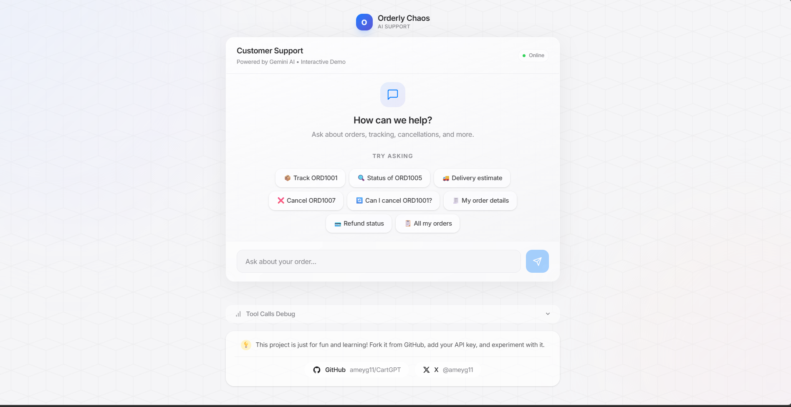

# 🛒 CartGPT (Orderly Chaos)
### An AI Ecommerce Support Playground & Multi-Turn Function Calling Agent

<p align="center">
  
</p>

<p align="center">
  <a href="https://github.com/ameyg11/CartGPT"></a>
  <a href="https://x.com/ameyg11"></a>
  
  
  
  
  
  
</p>

---

## 💡 About The Project

> **"This project is just for fun and learning! Fork it from GitHub, add your Gemini API key, and experiment with it."**

**CartGPT** (internally known as *Orderly Chaos*) is an intentionally modular full-stack playground built for mastering **LLM tool calling (function calling)**, **agentic reasoning loops**, and **self-healing execution** using the Google GenAI SDK and a realistic ecommerce backend.

It features:
1. An **Apple-inspired glassmorphism web interface** with smooth micro-animations, customizable prompt chips, and a real-time **Tool Debug Panel**.
2. An **Express + MongoDB backend** pre-seeded with real-world ecommerce data (orders, users, tracking, cancellations, refunds).
3. A **multi-turn AI agent** powered by Gemini that decides when to call database tools, execute actions, and synthesize clear customer service responses.

> [!NOTE]
> **Hosting Notice:** If you are exploring the online frontend deployment, note that it runs without the backend connected. To test live tool calls, order lookups, and AI cancellations, please **fork the repository, add your `GOOGLE_API_KEY`, and run the backend locally!**

---

## ✨ Features

- 🍏 **Apple-Inspired Interface**: Frosted glass cards, light ambient gradients, clean typography, responsive layout, and refined button micro-interactions.
- 🛠️ **Real-Time Tool Calls Debugger**: An expandable inspect panel revealing raw tool invocations, parameters, and database return payloads.
- 🤖 **Autonomous Multi-Turn Tool Calling**: Gemini automatically identifies customer intent, executes one or multiple backend tools, and synthesizes answers.
- 🛡️ **Self-Healing Agent Pattern**: Zod schema validation catches improper tool parameters and feeds errors back into Gemini's multi-turn loop for self-correction.
- 📦 **Complete Ecommerce Dataset**: Pre-populated database with various order statuses (`CONFIRMED`, `SHIPPED`, `DELIVERED`, `CANCELLED`).
- ⚡ **Interactive Quick Prompts**: One-click prompt chips covering order tracking, cancellation checks, shipping queries, and refunds.

---

## 🏗️ Architecture & Agent Flow

```text
┌─────────────────┐       User Prompt        ┌─────────────────────┐
│  React Chat UI  │ ───────────────────────> │ Express Backend API │
│  (Vite + Glass) │                          │     (/api/chat)     │
└────────┬────────┘                          └──────────┬──────────┘
         │                                              │
         │                                              │ Multi-turn interaction
         │                                              ▼
         │                                   ┌─────────────────────┐
         │                                   │  Google Gemini LLM  │
         │                                   │ (Function Calling)  │
         │                                   └──────────┬──────────┘
         │                                              │
         │                                              │ Emits function_call
         │                                              ▼
         │                                   ┌─────────────────────┐
         │                                   │ Tool Execution Loop │
         │                                   │ (Zod Validation)    │
         │                                   └──────────┬──────────┘
         │                                              │
         │                                              │ Query / Mutation
         │                                              ▼
         │                                   ┌─────────────────────┐
         │                                   │  MongoDB Database   │
         │                                   │  (Orders & Users)   │
         │                                   └──────────┬──────────┘
         │                                              │
         │                                              │ Returns function_result
         │                                              ▼
         │                                   ┌─────────────────────┐
         │                                   │ Gemini AI Synthesis │
         │                                   └──────────┬──────────┘
         │                                              │
         │ Final Assistant Answer + Debug Metrics       │
         └──────────────────────────────────────────────┘
```

---

## 📁 Repository Structure

```text
CartGPT/
├── client/                      # Frontend Application (React + Vite + Tailwind)
│   ├── src/
│   │   ├── assets/              # Logos, icons, and hero screenshots
│   │   ├── components/
│   │   │   ├── Chat.jsx         # Core customer support chat window
│   │   │   ├── ExamplePrompts.jsx # Interactive quick-prompt chips
│   │   │   ├── Footer.jsx       # Glass footer with project disclaimer & socials
│   │   │   ├── InputBox.jsx     # Modern input field with glass action button
│   │   │   ├── Message.jsx      # Apple-styled message bubbles
│   │   │   └── ToolDebugPanel.jsx # Real-time tool inspector with syntax badges
│   │   ├── services/
│   │   │   └── api.js           # Axios API client with offline demo detection
│   │   ├── App.jsx              # Centered layout & ambient gradient canvas
│   │   └── index.css            # Glassmorphism utilities & Apple design tokens
│   ├── index.html               # Web entry with Inter font
│   └── vite.config.js
│
└── server/                      # Backend Application (Node.js + Express + MongoDB)
    ├── practice/                # First-principles learning scripts & guides
    │   └── tool-schemas-practice.js # Deep dive: JSON Schema vs Zod vs Self-Healing
    ├── src/
    │   ├── config/              # Database connection
    │   ├── models/              # Mongoose schemas (Order, User, Product)
    │   ├── seed/                # Seed script with realistic sample data
    │   ├── services/
    │   │   ├── chat.service.js  # Agentic interaction loop & tool orchestration
    │   │   └── gemini.service.js# Gemini function declarations & configuration
    │   └── tools/               # Backend tool implementations (get, cancel, etc.)
    └── server.js                # Express entrypoint
```

---

## 🚀 Quick Start Guide

### 1. Prerequisites
- **Node.js**: v18 or higher
- **MongoDB**: Local MongoDB instance (`mongodb://localhost:27017`) or MongoDB Atlas URI
- **Google Gemini API Key**: Grab a free key from [Google AI Studio](https://aistudio.google.com/)

---

### 2. Backend Setup

```bash
cd server
npm install
```

Create a `.env` file inside the `server/` directory:

```env
PORT=5000
MONGODB_URI=mongodb://localhost:27017/orderly-chaos
GOOGLE_API_KEY=your_gemini_api_key_here
```

Seed the database with test orders:
```bash
npm run seed
```

Start the backend server in development mode:
```bash
npm run dev
# or: node server.js
```
The server will start listening at `http://localhost:5000`.

---

### 3. Frontend Setup

In a new terminal window:

```bash
cd client
npm install
npm run dev
```

Open your browser at **`http://localhost:5173`** to access the live application!

---

## 🧪 Practice & Implement Tools

CartGPT is built as a hands-on playground. You can inspect or build the following tools:

| Tool Name | Parameters | Purpose | Sample Test Prompt |
| :--- | :--- | :--- | :--- |
| `get_order` | `orderId: string` | Retrieves details and status of an order | *"Where is ORD1001?"* |
| `get_customer_orders` | `email: string` | Fetches purchase history for a customer | *"Show all orders for amey@example.com"* |
| `track_order` | `orderId: string` | Gets real-time shipping carrier & checkpoints | *"Track ORD1005"* |
| `cancel_order` | `orderId: string, reason?: string` | Cancels unshipped orders and triggers refund | *"Cancel order ORD1007"* |
| `refund_order` | `orderId: string` | Issues refund for eligible returns | *"Can I get a refund for ORD1004?"* |

### Hands-on Practice Guide
Check out [`server/practice/tool-schemas-practice.js`](file:///server/practice/tool-schemas-practice.js) for an interactive, console-executable deep dive on:
1. Why manual parsing breaks in production.
2. How JSON Schema works under the hood.
3. Declarative schema generation with **Zod** (`zod-to-json-schema`).
4. Building **Self-Healing Agent loops** that recover automatically from hallucinated tool parameters.

---

## 🛠️ Technology Stack

| Layer | Technologies |
| :--- | :--- |
| **Frontend** | React 19, Vite, Tailwind CSS v4, Vanilla CSS Glassmorphism, Inter Font |
| **Backend** | Node.js, Express 5, Axios, Dotenv |
| **AI / LLM** | `@google/genai` (Gemini Flash / Pro Models), Function Calling API |
| **Validation** | Zod, Zod-to-JSON-Schema |
| **Database** | MongoDB, Mongoose 9 |

---

## 👨‍💻 Author & Connect

Developed by **Amey Gawade**:

- 🐙 **GitHub**: [@ameyg11](https://github.com/ameyg11) — [CartGPT Repository](https://github.com/ameyg11/CartGPT)
- 𝕏 **X (Twitter)**: [@ameyg11](https://x.com/ameyg11)

---

## 📄 License

This project is open-source and available under the [MIT License](LICENSE). Feel free to fork, experiment, and build your own autonomous agents!
